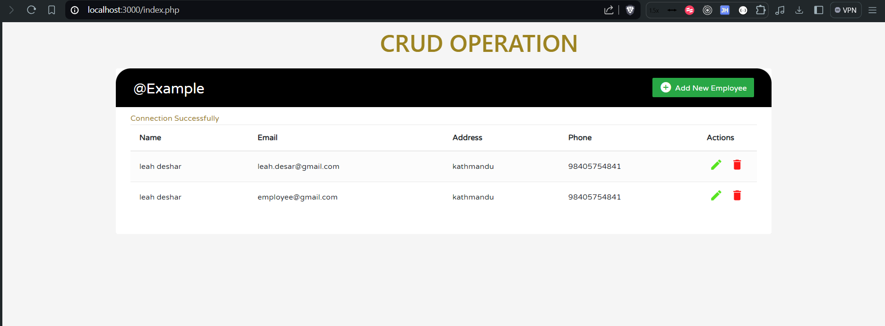

# Sample PHP

CRUD (Create, Read, Update, Delete) application for managing user data. The application is built using PHP, MySQL, and Bootstrap.

## Technologies Used

**PHP**: Server-side scripting language used to handle the backend logic.
**MySQL**: Relational database management system used to store user data.
**Bootstrap**: Frontend framework for styling and responsive design.
**HTML/CSS**: Markup and styling languages for creating the web pages.
**JavaScript/jQuery**: Used for client-side interactivity and AJAX.

## Features

**Create**: Add new users to the database.
**Read**: Display user data in a tabular format.
**Update**: Edit and update existing user information.
**Delete**: Remove users from the database.

#### SQL Script to Create Database and Table

```
CREATE DATABASE crud;

USE crud;

CREATE TABLE user (
id INT AUTO_INCREMENT PRIMARY KEY,
name VARCHAR(100) NOT NULL,
email VARCHAR(100) NOT NULL,
address VARCHAR(255) NOT NULL,
phone VARCHAR(15) NOT NULL
);

```

### Output


